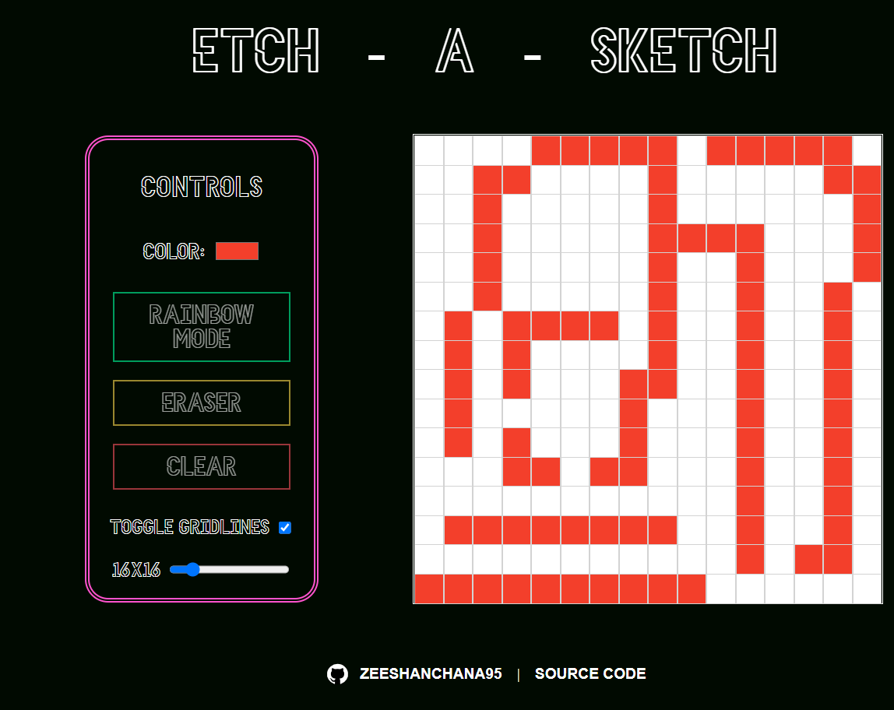

# Etch-a-Sketch

A simple Etch-a-Sketch application built with HTML, CSS, and JavaScript.

## Usage

To use the Etch-a-Sketch application, follow these steps:

1. Use the controls to draw on the grid:
   - Use the color picker to select a drawing color.
   - Click the "Rainbow mode" button to enable rainbow coloring.
   - Click the "Eraser" button to switch to eraser mode.
   - Click the "Clear" button to clear the entire grid.
   - Toggle the "Toggle Gridlines" checkbox to show/hide gridlines.
   - Adjust the slider to change the size of the grid.

2. Start drawing on the grid by clicking and dragging the mouse cursor.

## Features

- Customizable color selection with the color picker.
- Rainbow mode for a random and colorful drawing experience.
- Eraser mode to remove drawing colors.
- Clear button to reset the entire grid.
- Toggle gridlines to show/hide the grid.
- Adjustable grid size using the slider.

## Dependencies

The Etch-a-Sketch application relies on the following files:

- `index.html`: Contains the HTML structure of the application.
- `style.css`: Provides the styles and layout for the application.
- `script.js`: Implements the functionality and interactivity of the application.
- `icon.png`: Represents the application icon.

